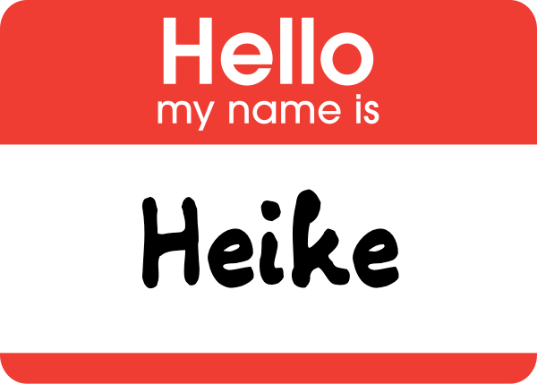
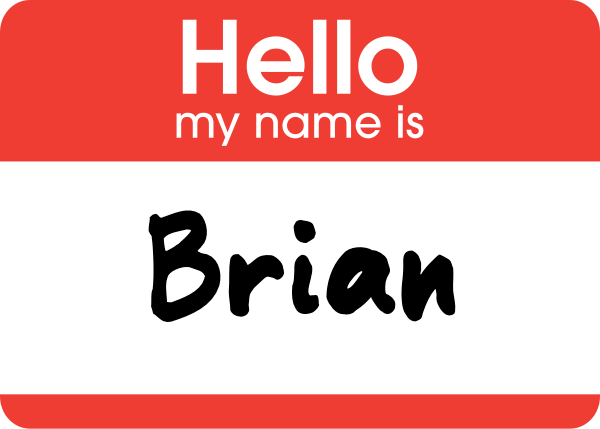
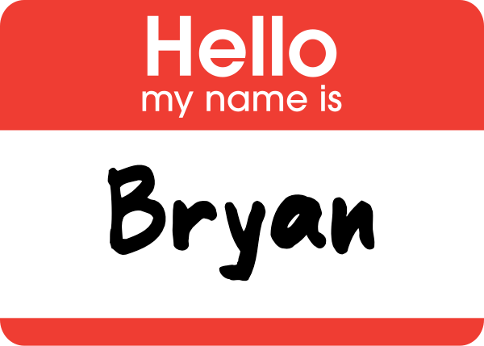
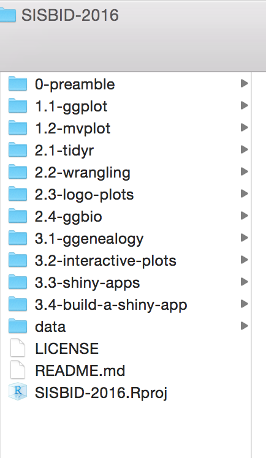
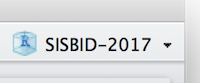
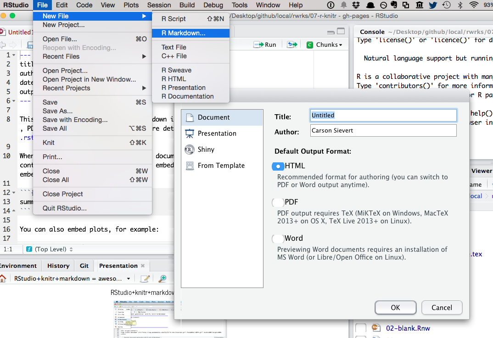

```{r, echo = FALSE, message = FALSE, warning = FALSE, warning = FALSE}
knitr::opts_chunk$set(
  message = FALSE,
  warning = FALSE,
  error = FALSE, 
  collapse = TRUE,
  comment = "#",
  fig.height = 4,
  fig.width = 8,
  fig.align = "center",
  cache = FALSE
)
```

## 


##



##



##



## Getting up and running

- R and RStudio
- Projects
- RMarkdown
- Web site

## R is ...

* __Free__ to use
* __Extensible__
    * Over 8500 user contributed add-on packages currently on CRAN!
* __Powerful__
    * With the right tools, get more work done, faster.
* __Flexible__
    * Not a question of _can_, but _how_.
* __Frustrating__
    * Flexibility comes at a cost (easy to shoot yourself in the foot!).

```{r, eval = FALSE, echo = FALSE}
# devtools::install_github("metacran/crandb")
# pkgs <- crandb::list_packages(limit = 999999)
# length(pkgs)
# [1] 8654
```

## RStudio is ...

[From Julie Lowndes](http://jules32.github.io/resources/RStudio_intro/):  

<blockquote>
<b>If R were an airplane, RStudio would be the airport</b>, providing many, many supporting services that make it easier for you, the pilot, to take off and go to awesome places. Sure, you can fly an airplane without an airport, but having those runways and supporting infrastructure is a game-changer.
</blockquote>

## The RStudio IDE

1. Source editor: Docking station for multiple files, Useful shortcuts ("Knit"), Highlighting/Tab-completion, Code-checking (R, HTML, JS), Debugging features  
2. Console window: Highlighting/Tab-completion, Search recent commands
3. Other tabs/panes: Graphics, R documentation, Environment pane, File system navigation/access, Tools for package development, git, etc

## Files for this workshop

- [github site](https://github.com/SISBID/Module2) contains all the markdown files, code files, and data for this workshop
- Clone a copy to your desktop

<div align="center">
  
</div>

## Projects

Creating a project helps organise work. For this workshop, I have created a project on my laptop called `SISBID-2016`. 



## Your turn

Create a project for this workshop, in the directory where you downloaded the files from github. (Be sure that you open this at the start of each session. Generally it is a good idea NOT TO SAVE THE WORKSPACE when you close a project for the day.)

* File -> New Project -> Existing Directory -> Empty Project

## Hello R Markdown!

* File -> New File -> R Markdown -> OK -> Knit HTML

<div align="center">
  
</div>

## What is R Markdown?

- From the [R Markdown home page](http://rmarkdown.rstudio.com/):

- R Markdown is an authoring format that enables easy creation of dynamic documents, presentations, and reports from R. 
- It combines the core syntax of __markdown__ (an easy-to-write plain text format) __with embedded R code chunks__ that are run so their output can be included in the final document. 
- R Markdown documents are fully reproducible (they can be automatically regenerated whenever underlying R code or data changes).

## Installing packages

From CRAN

```{r eval=FALSE}
install.packages("ggenealogy")
```

##

From bioconductor

```{r eval=FALSE}
source("https://bioconductor.org/biocLite.R")
biocLite("ggbio")
```

##

From github repos

```{r eval=FALSE}
devtools::install_github("heike/gglogo")
devtools::install_github("haleyjeppson/ggmosaic")
```

## Resources


- [RStudio IDE cheat sheet](http://www.rstudio.com/wp-content/uploads/2016/01/rstudio-IDE-cheatsheet.pdf)
- [rmarkdown cheat sheet](http://www.rstudio.com/wp-content/uploads/2016/03/rmarkdown-cheatsheet-2.0.pdf)
- [Q/A site: http://stackoverflow.com](http://stackoverflow.com)
- [Dynamic Documents with R and knitr, Yihui Xie](http://yihui.name/knitr/)

## Share and share alike

Materials for this workshop build on slides provided by several people, but primarily Hadley Wickham and Carson Sievert. 

This work is licensed under the Creative Commons Attribution-Noncommercial 3.0 United States License. To view a copy of this license, visit http://creativecommons.org/licenses/by-nc/ 3.0/us/ or send a letter to Creative Commons, 171 Second Street, Suite 300, San Francisco, California, 94105, USA.
