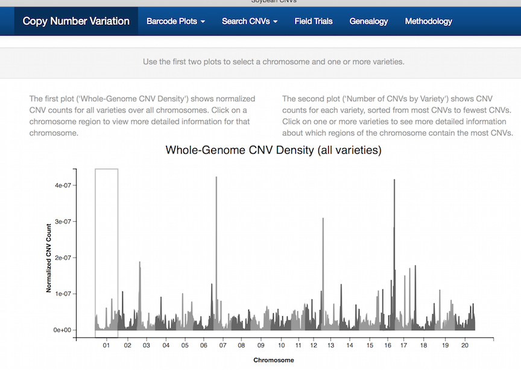
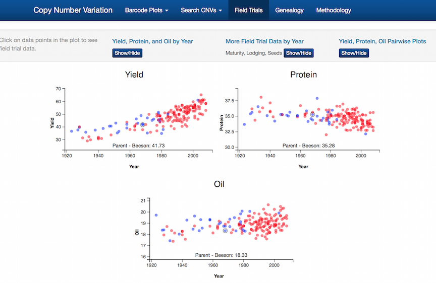

```{r, echo = FALSE, warning = FALSE, message=FALSE}
knitr::opts_chunk$set(
  message = FALSE,
  warning = FALSE,
  collapse = TRUE,
  comment = "#>",
  fig.height = 4,
  fig.width = 8,
  fig.align = "center",
  cache = FALSE
)
library(ggplot2)
library(tidyr)
library(dplyr)
library(lubridate)
library(scales)
library(readr)
```

## A shiny app for exploring soybean milestone cultivars

- Explore genetic signatures, genealogy and phenotypic changes of soybean breeding
- Ultimate task is to understand how the genome changed with the breeding of lines, and how this affected other traits

## Data: three sources

- Next-generation sequencing DNA-seq on 79 lines: DNA sequencing libraries were prepared using TruSeq DNA sample prep and NuGENs unamplified prep kits (Illumina Inc., San Diego, CA and NuGEN Technologies Inc., San Carlos, CA). 
- Field yield trials: 30/79 + 138 ancestral lines
- Breeding literature, what lines were bred to produce what line

## Three apps

- Copy number variation (CNV): 2Gb of analysis files, annotations
- SNPs: 12Gb of data, 20mill SNPs, 1mil locations, 79 lines
- Genealogy: Shows the parent to child lineage

## CNV app

- Seven tabs containing different functionality
- Four of the tabs, CNV Location, Copy Number, "Search CNVs by Location", and CNV List, primarily concerned with exploring the identified copy number variants
- The other three tabs, Phenotype Data, Genealogy, and Methodology provide additional information about the soybean cultivars and the experimental methodology
- App written by Dr Susan Vanderplas

## Software

- shiny: provides the infrastructure, web interface
- ggplot2: static plots
- animint: interactive plots

## Main page



## 


## Your turn


What does copy number variation mean?

## Barcode plots


## Field trial data



## Lineage


## Your turn


Open up the copy number variation (CNV) app on your computer [http://shiny.soybase.org/CNV/](http://shiny.soybase.org/CNV/)

or 

[http://srvanderplas.com/Shiny/SoybeanApp/CNV/](http://srvanderplas.com/Shiny/SoybeanApp/CNV/)

(It might be best to share one computer between three or four people, so that the servers don't get overloaded.)

## Your turn


- Has yield increased over the years?
- What is the relationship between yield and protein?
- What is the name of the line that is a recent development, and was sequenced in the study? 
- Find a line who's yield is lower than both parents. 

(Hint: Use the `Field Trials` tab.)

```{r echo=FALSE, eval=FALSE}
Yield has increased fairly linearly over the years.

There is a negative relationship between yield and protein, as yield has increased protein content has declined.

IA 3023

Lawrence
```

## Your turn


- Is `Conrad` a descendant of `Essex`?
- Who are the grandparents of `Essex`?
- How is `Illini` related to `Lawrence`?

(Hint: Use the `Genealogy` tab.)

```{r eval=FALSE, echo=FALSE}
Yes

Perry, N48-1248, S-100, CNS

Illini is a great-great-grandparent of Lawrence
```

## Your turn


Find some locations on the genome that Lawrence might have inherited from Illini. 

(Hint: Use the `Barcode plots`.)

```{r eval=FALSE, echo=FALSE}
middle of Chr 1, chunks of Chr 3, one spot on Chr 8, end of Chr 16, ...
```

## SNP app

- Five tabs containing different functionality
- Overview, SNP locations, search by id, SNP browser, SNP distance and the Kevin Bacon distance
- App written by Susan Vanderplas

## Browse SNPs


##


##


##


## Quick overview of three other shiny apps

- Exploring the answer space for a theoretical question: https://erichare.shinyapps.io/pelica/
- Getting an image and the code for a logo plot:  https://erichare.shinyapps.io/gglogo/
- Finding a statistical answer to a matching problem: http://erichare.shinyapps.io/x3prplus 

- Author: Eric Hare

## PeLiCa - peptide library calculator

https://erichare.shinyapps.io/pelica/

- interactive tool to help plan an experiment 
- What is the baseline probability that a peptide of length p is included in a synthetic library of size N (really large)?
- What role does peptide encoding play?

## Expected Coverage 


## Creating a logo plot

https://erichare.shinyapps.io/gglogo/


## Matching Bullets

https://erichare.shinyapps.io/x3prplus/


## Your turn


Pick one of the three shiny apps and explore it for yourself:

- peptide libraries: http://erichare.shinyapps.io/pelica
- logo plot: http://erichare.shinyapps.io/gglogo
- bullet matching: http://erichare.shinyapps.io/x3prplus 


## Resources

- [Cheat sheet](https://www.rstudio.com/wp-content/uploads/2015/08/ggplot2-cheatsheet.pdf)
- [ggplot2: Elegant Graphics for Data Analysis, Hadley Wickham](http://ggplot2.org/book/), [web site](http://ggplot2.org)
- [R Graphics Cookbook, Winston Chang](http://www.cookbook-r.com/Graphs/)
- [Q/A site: http://stackoverflow.com](http://stackoverflow.com)
- [Dynamic Documents with R and knitr, Yihui Xie, ](http://yihui.name/knitr/)
- [Naomi Robbins, Creating More Effective Graphs](http://www.nbr-graphs.com)
- [Antony Unwin, Graphical Data Analysis with R](https://www.crcpress.com/Graphical-Data-Analysis-with-R/Unwin/9781498715232)

## Share and share alike

This work is licensed under the Creative Commons Attribution-Noncommercial 3.0 United States License. To view a copy of this license, visit http://creativecommons.org/licenses/by-nc/ 3.0/us/ or send a letter to Creative Commons, 171 Second Street, Suite 300, San Francisco, California, 94105, USA.
