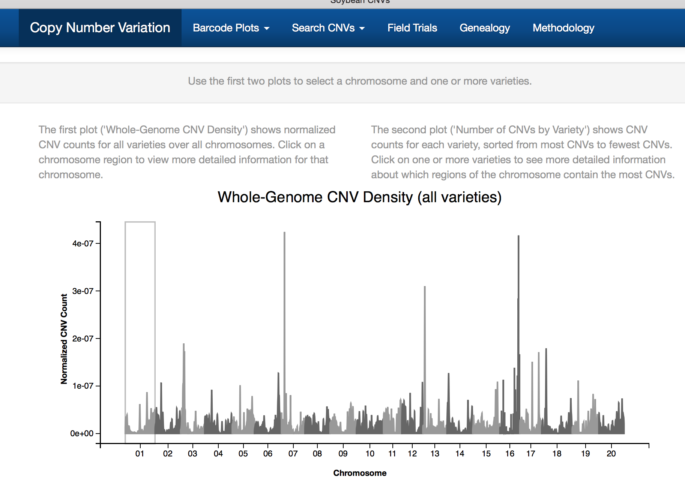
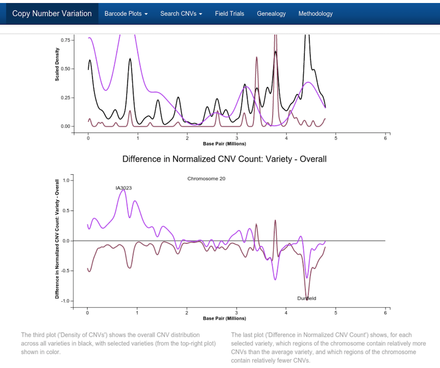
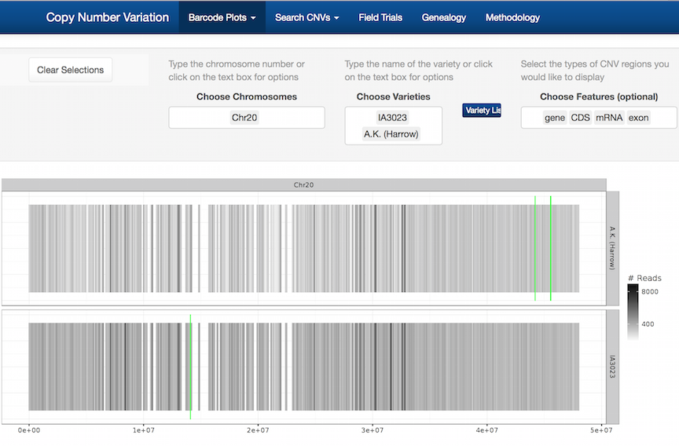
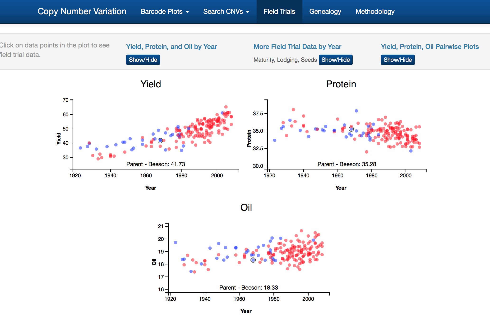

```{r, echo = FALSE, warning = FALSE, message=FALSE}
knitr::opts_chunk$set(
  message = FALSE,
  warning = FALSE,
  collapse = TRUE,
  comment = "#>",
  fig.height = 4,
  fig.width = 8,
  fig.align = "center",
  cache = FALSE
)
library(ggplot2)
library(tidyr)
library(dplyr)
library(lubridate)
library(scales)
library(readr)
```

## A shiny app for exploring soybean milestone cultivars

- Explore genetic signatures, genealogy and phenotypic changes of soybean breeding
- Ultimate task is to understand how the genome changed with the breeding of lines, and how this affected other traits

## Data: three sources

- Next-generation sequencing DNA-seq on 79 lines: DNA sequencing libraries were prepared using TruSeq DNA sample prep and NuGENs unamplified prep kits (Illumina Inc., San Diego, CA and NuGEN Technologies Inc., San Carlos, CA). 
- Field yield trials: 30/79 + 138 ancestral lines
- Breeding literature, what lines were bred to produce what line

## Three apps

- Copy number variation (CNV): 2Gb of analysis files, annotations
- SNPs: 12Gb of data, 20mill SNPs, 1mil locations, 79 lines
- Genealogy: Shows the parent to child lineage

## CNV app

 -Seven tabs containing different functionality
- Four of the tabs, CNV Location, Copy Number, "Search CNVs by Location", and CNV List allow primarily concerned with exploring the identified copy number variants
- The other three tabs, Phenotype Data, Genealogy, and Methodology provide additional information about the soybean cultivars and the experimental methodology
- App written by Dr Susan Vanderplas

## Software

- shiny
- ggplot2
- animint

##



##



##



##




## Your turn


[Explore copy number variation (CNV)](http://shiny.soybase.org/CNV/)


## Other apps

https://erichare.shinyapps.io/gglogo/

https://erichare.shinyapps.io/pelica/


## Your turn


[Explore copy number variation (CNV)](http://shiny.soybase.org/SNP/)


## Resources

- [Cheat sheet](https://www.rstudio.com/wp-content/uploads/2015/08/ggplot2-cheatsheet.pdf)
- [ggplot2: Elegant Graphics for Data Analysis, Hadley Wickham](http://ggplot2.org/book/), [web site](http://ggplot2.org)
- [R Graphics Cookbook, Winston Chang](http://www.cookbook-r.com/Graphs/)
- [Q/A site: http://stackoverflow.com](http://stackoverflow.com)
- [Dynamic Documents with R and knitr, Yihui Xie, ](http://yihui.name/knitr/)
- [Naomi Robbins, Creating More Effective Graphs](http://www.nbr-graphs.com)
- [Antony Unwin, Graphical Data Analysis with R](https://www.crcpress.com/Graphical-Data-Analysis-with-R/Unwin/9781498715232)

## Share and share alike

This work is licensed under the Creative Commons Attribution-Noncommercial 3.0 United States License. To view a copy of this license, visit http://creativecommons.org/licenses/by-nc/ 3.0/us/ or send a letter to Creative Commons, 171 Second Street, Suite 300, San Francisco, California, 94105, USA.
