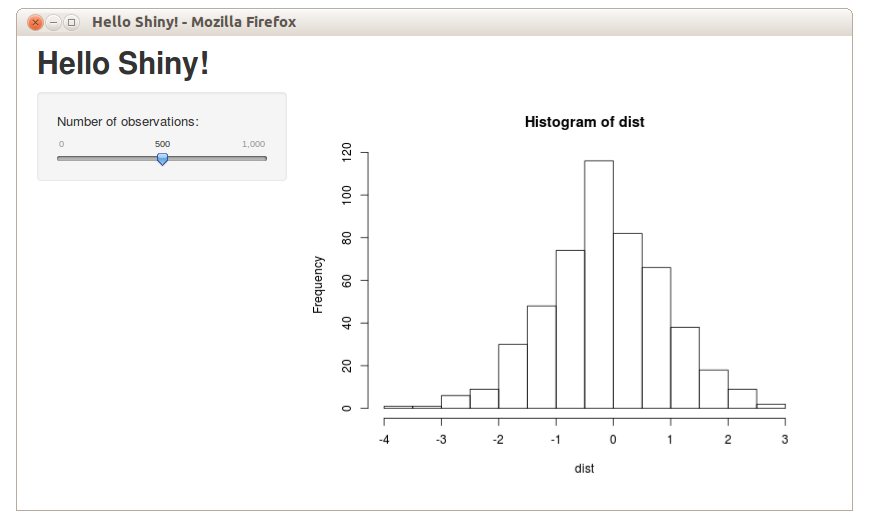

```{r, echo = FALSE, warning = FALSE, message = FALSE}
knitr::opts_chunk$set(
  message = FALSE,
  warning = FALSE,
  collapse = TRUE,
  comment = "#>",
  fig.height = 4,
  fig.width = 8,
  fig.align = "center",
  cache = FALSE
)
library(ggplot2)
library(tidyr)
library(dplyr)
library(lubridate)
library(scales)
library(readr)
library(ggmap)
library(HLMdiag)
library(RColorBrewer)
library(gridExtra)
```

## Outline

**Shiny** is an R package that allows you to easily create interactive web applets using R. 

- Produced by [RStudio](http://shiny.rstudio.com)
- Code can be entirely within R (or customize with HTML/JavaScript)
- Take a look at RStudio's [showcase](http://shiny.rstudio.com/gallery/) of Shiny applets

## Shiny Documentation and Help

- [RStudio Tutorial](http://shiny.rstudio.com/tutorial/)  
Much of tonight's material is motivated by this tutorial
- [Shiny Setup, Showcase, and Server setup](http://shiny.rstudio.com)  
Useful if you want to use shiny on your own webserver
- [Shiny Github Page](https://github.com/rstudio/shiny)  
See the latest updates
- [Shiny Mailing List](https://groups.google.com/forum/#!forum/shiny-discuss)  
Check the tutorial first, then search the mailing list.


## Run a first Example yourself

1. set your working directory to the folder 3.4-build-a-shiny-app

```{r, eval=FALSE}
setwd("3.4-build-a-shiny-app")
```

2. Run the following code:

```{r, eval=FALSE}
library(shiny)
runApp("01_Hello")
```
<center>

</center>

## A Tale of Two Files

The quickest/easiest way to create a shiny app is to define the user interface in a file named **ui.R** and the server side functionality in **server.R**.

- **ui.R** defines the page layout and user interface
- **server.R** contains the R code to create any output

## ui.R

```{r, eval=FALSE}
library(shiny)

# A simple/common user interface template
shinyUI(fluidPage(

  # Application title
  titlePanel("Title"),
  
  sidebarPanel(
    # Define some inputs here
  ),
  
  mainPanel(
    # output (from the server) go here
  )

))
```

## server.R

```{r, eval=FALSE}
library(shiny)

# Server side logic 
shinyServer(function(input, output) {
  # do something
})
```

## Reactivity

shiny is built on the idea of **reactive programming**. The idea that outputs should be automatically updated whenever an input value changes.

```
input values => R code => output values
```

**Reactive expressions** keep track of what values they read and what values they change. If those values become "out of date", they know their return value is out of date and will automatically recalculate.

## An example

```{r, eval=FALSE}
runApp("02_Reactivity", display.mode = "showcase")
```

## Your Turn 


- Consider extending the hello world example:

```{r, eval=FALSE}
runApp("01_Hello", display.mode = "showcase")
```

- **Challenge 1:** add an input to change the mean and standard deviation (Hint: see `?numericInput`).
- **Challenge 2:** add an input to simulate from a gamma as well as a normal (Hint: you can simulate from gamma distribution with `rgamma`).
- **Challenge 3:** Extend **Challenge 2** so that there are dynamic inputs according to the desired distribution. That is, display mean and std dev inputs for normal distribution and a shape input for gamma (Hint: see `conditionalPanel`).


## Shiny Inputs

Shiny has many different input options:

- `actionButton()` - creates a clickable button
- `checkboxInput()` and `checkboxGroupInput()`
- `dateInput()` - calendar to select a date
- `dateRangeInput()` - select a range of dates
- `fileInput()` - upload a file
- `numericInput()` - input a numeric value
- `radioButtons()` - select one or more items
- `sliderInput()` - slide along a range of values
- `textInput()` - input a string

## Shiny Outputs

Shiny also has many output options:

- `renderDataTable()` - outputs an interactive, sortable data table
- `htmlOutput()` - output html elements
- `renderPlot()` - output an R plot
- `renderPrint()` - output text from print() in R
- `renderTable()` - output an HTML table
- `renderText()` - output text from R
- `renderUI()` - output a custom part of the user interface
- `renderImage()` - print an image to the page

## Other User Interface Options

- `tabsetPanel()` - make multiple different output views (i.e. a plot in one tab, a data table in another)
- `helpText()` - create additional text to help users navigate your applet
- `submitButton()` - only update outputs when this button is clicked
- `conditionalPanel()` - only show certain UI options when conditions are met (i.e. if a certain tab is open, or a certain input is selected)

## Your Turn 


Using your own data or the NYC crime data provided, create a simple Shiny app. 
Use the NYC_Emergency app as a starting point.

```{r, eval=FALSE}
runApp("03_NYC_Emergency")
```

- Ideas: 
    - Plot some aspect of the data with color based on another aspect of the data
    - Use `subset()` and `checkboxInput()` to plot user-selected subsets
    - Use `tabsetPanel()` to display different tables/plots
    - **Extra Challenging:** Can you make a map of NYC crime by location?

## Resources

- [Cheat sheet](https://www.rstudio.com/wp-content/uploads/2015/08/ggplot2-cheatsheet.pdf)
- [ggplot2: Elegant Graphics for Data Analysis, Hadley Wickham](http://ggplot2.org/book/), [web site](http://ggplot2.org)
- [RStudio Tutorial](http://shiny.rstudio.com/tutorial/)  
Much of tonight's material is motivated by this tutorial
- [Shiny Setup, Showcase, and Server setup](http://shiny.rstudio.com)  
Useful if you want to use shiny on your own webserver
- [Shiny Github Page](https://github.com/rstudio/shiny)  
See the latest updates
- [Shiny Mailing List](https://groups.google.com/forum/#!forum/shiny-discuss)  
Check the tutorial first, then search the mailing list.

## Share and share alike

This work is licensed under the Creative Commons Attribution-Noncommercial 3.0 United States License. To view a copy of this license, visit http://creativecommons.org/licenses/by-nc/ 3.0/us/ or send a letter to Creative Commons, 171 Second Street, Suite 300, San Francisco, California, 94105, USA.
